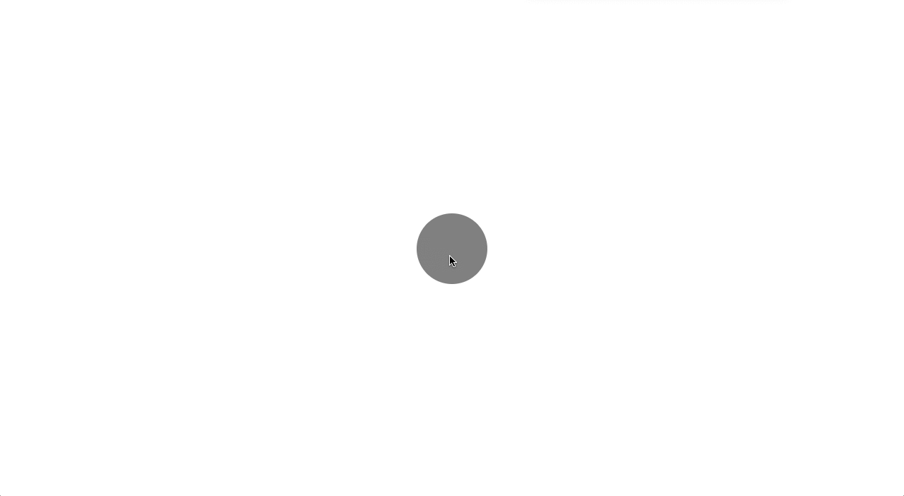

# random-challenges
Folder of random ideas that pop into my head that I tried to implement

1. Single Circle that Changes Colors (8.16.18)   
  A simple html & css page that has a cirlce in the center that goes through an array of colors when you click on it.
  
